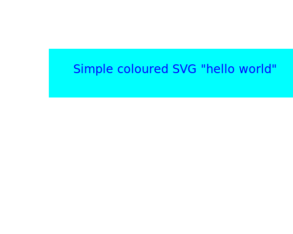

# TO ADD

## Python-Excel

- Examples of Excel-2-HTML conversion for different Python-Excel libraries
  - highlight strengths/weaknesses
  
- Examples of use of different Python-Excel libraries to copy/create Excel files
  - highlight strengths/weaknesses
    - openpyxl: can read/write .xlx/.xlsx files (but buggy)
    - xlrd: can copy worksheets, but copies values only not formulas, not formats

## Python-Powerpoint

- Python-PPTX examples
  - More elaborate slide creaton examples
  - Read existing .PPTX, attempt French-English translation
  - Read existing .PPTX, attempt conversion to javascript slideset, e.g. Remark.js, WebSlides
  - Read existing javascript slideset, e.g. Remark.js, WebSlides, generate .PPTX
  

## Experiments

### Embedding SVG - not allowed (by github.com sanitizer):

<h1>Example of embedded SVG</h1> <table> <tbody> <tr>
  <th></th>  <th></th>  <th></th> 
</tr>
<tr>
  <td>img tag:</td>
  <td>
	  <svg height="30" width="200">
		    <text x="0" y="15" fill="red"> SVG is not rendered - only element text is shown on github</text>
	  </svg>
	</td> <td>
	  <svg height="30" width="200" xmlns:xlink="http://www.w3.org/1999/xlink">
		    <a xlink:href="https://www.w3schools.com/graphics/" target="_blank">
			        <text x="0" y="15" fill="red" text-decoration="underline"> SVG is not rendered  - only element text (a link) is shown on github </text>
				  </a>
	  </svg>
  </td>
</tr>
<tr>
  <td></td>
  <td></td>
  <td></td>
</tr>
 </tbody> </table>

### Linking to SVG - not allowed (by github.com sanitizer):

<h1>Example of embedded SVG</h1> <table> <tbody> <tr>
  <th></th>  <th></th>  <th></th> 
</tr>
<tr>
  <td>img tag:</td>
  <td>
	  
	</td> <td>
	  <svg height="30" width="200" xmlns:xlink="http://www.w3.org/1999/xlink">
		    <a xlink:href="https://www.w3schools.com/graphics/" target="_blank">
			        <text x="0" y="15" fill="red" text-decoration="underline"> SVG is not rendered  - only element text (a link) is shown on github </text>
				  </a>
	  </svg>
  </td>
</tr>
<tr>
  <td></td>
  <td></td>
  <td></td>
</tr>
 </tbody> </table>

